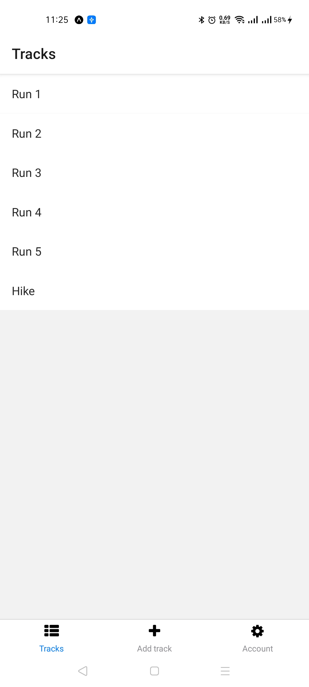
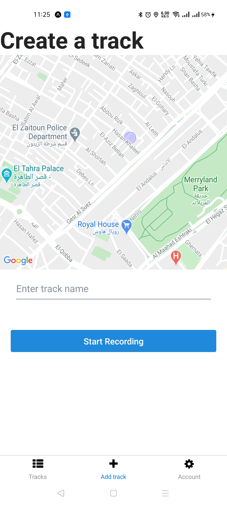
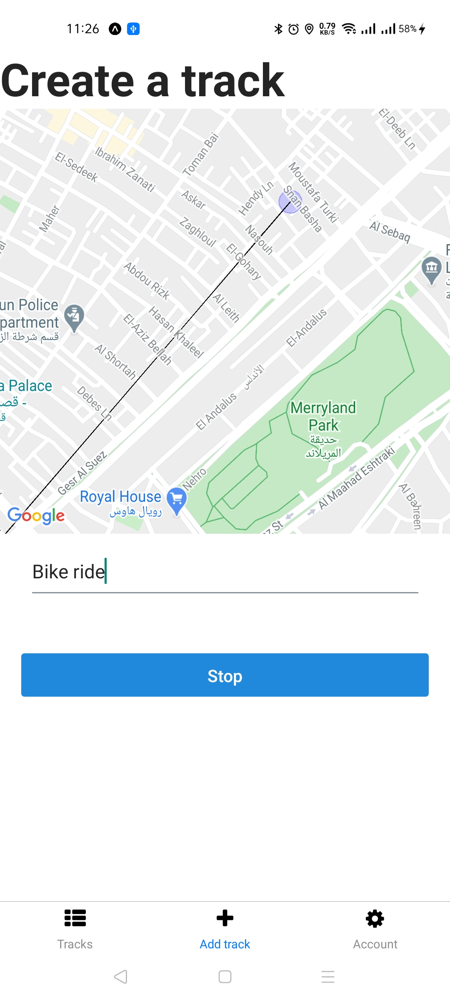
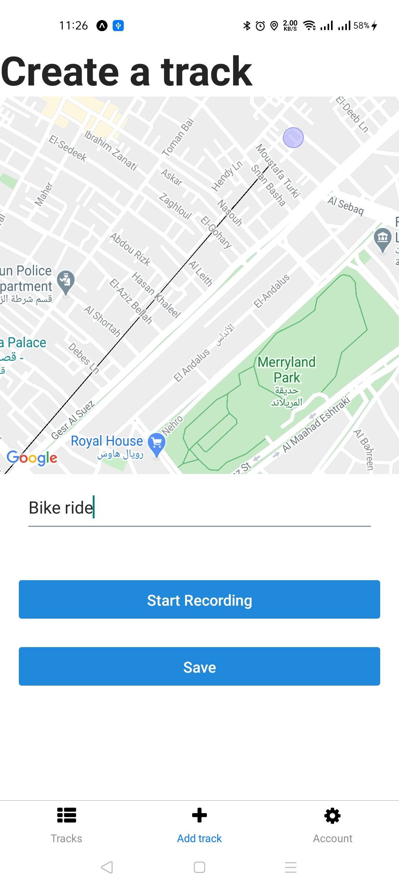

# Tracks

An application used to track user's runs, hikes, bike rides, etc. Tracking is based on user location, Visualizing routes in real map, Stores routes using custom Express Api. Built with React Native, Context, Express.js, JavaScript.

## Project Screen Shots
---

## Main technologies used
---
* [React Native](https://github.com/facebook/react-native)
> A framework for building native apps with React.
* [Context](https://reactjs.org/docs/context.html)
> Context provides a way to pass data through the component tree without having to pass props down manually at every level.
* [react-native-location](https://www.npmjs.com/package/react-native-location)
> Native GPS location support for React Native that includes many additional features.
* [Express.js](https://expressjs.com/)
> Express is designed for building web applications and APIs. It has been called the de facto standard server framework for Node.js
* [React Native Elements](https://github.com/react-native-elements/react-native-elements)
> Cross Platform React Native UI Toolkit.
* [React Native Victor Icons](https://oblador.github.io/react-native-vector-icons/)
> Customizable Icons for React Native with support for NavBar/TabBar, image source and full styling.
* [React Navigation](https://reactnavigation.org/)
> React Navigation provides a way for your app to transition between screens and manage navigation history.

## Installation and Setup Instructions
---
Clone down this repository. You will need `node` and `npm` installed globally on your machine.
 
Installation:
 
`npm install`
 

To Run Test Suite:
 
`npm test`
 

To Start Server:
 
`npm start`
 

To visit app:
 
`http://localhost:19002/`

## Reflection
---
This was a 3 day long project. Project goals included using technologies learned up until this point and familiarizing myself with documentation for new features.

Originally I wanted to build an application that allowed users to track their different routes using their location. I started this process by using the create-react-app boilerplate, then adding react-native-location and setup context.

One of the main challenges I ran into was how to track user's location and keep updating route during movement. This lead me to spend a lot of time on a research, At the end i reached the soultion using react-native-location features.

At the end of the day, the technologies implemented in this project are React, Context, Express, react-native-location, and a significant amount of VanillaJS, JSX, and CSS. I chose to use the create-react-app boilerplate to minimize initial setup and invest more time in diving into weird technological rabbit holes. In the next iteration I plan on handrolling a webpack.config.js file to more fully understand the build process.